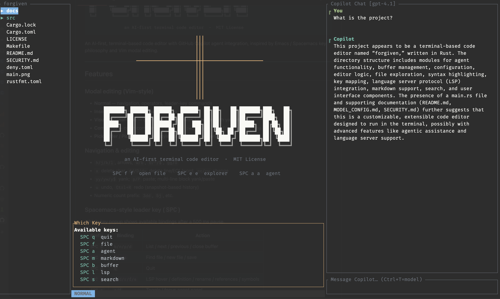

```
                               ┃┃┃
                               ┃┃┃
                               ┃┃┃
           ━━━━━━━━━━━━━━━━━━━━╋╋╋━━━━━━━━━━━━━━━━━━━━
                               ┃┃┃
                               ┃┃┃
                               ┃┃┃
                               ┃┃┃
                               ┃┃┃

███████╗ ██████╗ ██████╗  ██████╗ ██╗██╗   ██╗███████╗███╗   ██╗
██╔════╝██╔═══██╗██╔══██╗██╔════╝ ██║██║   ██║██╔════╝████╗  ██║
█████╗  ██║   ██║██████╔╝██║  ███╗██║██║   ██║█████╗  ██╔██╗ ██║
██╔══╝  ██║   ██║██╔══██╗██║   ██║██║╚██╗ ██╔╝██╔══╝  ██║╚██╗██║
██║     ╚██████╔╝██║  ██║╚██████╔╝██║ ╚████╔╝ ███████╗██║ ╚████║
╚═╝      ╚═════╝ ╚═╝  ╚═╝ ╚═════╝ ╚═╝  ╚═══╝  ╚══════╝╚═╝  ╚═══╝

              an AI-first terminal code editor  ·  MIT License
```

> **Alpha release** — forgiven is under active development. Expect rough edges,
> breaking keybinding changes, and missing polish. Feedback and bug reports are
> welcome via [GitHub Issues](https://github.com/danebalia/forgiven/issues).

An AI-first, terminal-based code editor with GitHub Copilot agent integration, inspired
by Emacs / Spacemacs key philosophy and Vim modal editing.

---

## Features

### Modal editing (Vim-style)
- **Normal** — navigation, operators, leader-key commands
- **Insert** — full text insertion and deletion
- **Visual / Visual-Line** — character and line-wise selection with yank/delete
- **Command** — colon commands (`:w`, `:q`, `:wq`, `:q!`, `:e <file>`, `:bn`, `:bp`)
- **PickBuffer / PickFile** — fuzzy-style buffer and file pickers
- **Explorer** — file tree navigation with create / rename / delete
- **RenameFile** — inline name editor with confirmation (`Enter`) or cancel (`Esc`)
- **DeleteFile** — delete confirmation popup (`y` = confirm, `n`/`Esc` = cancel)
- **NewFolder** — inline folder name editor with confirmation (`Enter`) or cancel (`Esc`)
- **InFileSearch** — `/` search with `n`/`N` next/prev match navigation

### Navigation & editing
- `h/j/k/l`, arrows, `w/b`, `0/^/$`, `gg/G`
- `x` delete char, `dd/D/dw` delete line/EOL/word, `cc/cw` change
- `dt{c}/df{c}` delete till/find char; `yt{c}/yf{c}` yank; `ct{c}/cf{c}` change
- `f{c}/t{c}` jump to/before char forward; `F{c}/T{c}` jump backward
- `yy/yw/y$` yank; `p/P` paste; multi-line block yank/paste
- `u` undo, `Ctrl+R` redo (snapshot-based history)
- Numeric count prefix: `3dd`, `5j`, etc.

### Spacemacs-style leader key (`SPC`)
Which-key popup shows available bindings after a 500 ms pause.

| Prefix | Binding | Action |
|--------|---------|--------|
| `SPC b` | `b/n/p/d` | List / next / previous / close buffer |
| `SPC f` | `f/n/s` | Find file / new file / save |
| `SPC q` | `q` | Quit |
| `SPC l` | `h/d/r/f/s` | LSP hover / definition / rename / references / symbols |
| `SPC a` | `a/f` | Toggle / focus agent panel |
| `SPC e` | `e/f/h` | Toggle / focus file explorer / toggle hidden files |
| `SPC g` | `g` | Open lazygit |
| `SPC m` | `p/b` | Markdown preview toggle / open in browser |
| `SPC s` | `g` | Search text in project (ripgrep) |

### Language Server Protocol
- Auto-connects to `rust-analyzer` and `copilot-language-server` on startup
- Inline diagnostics gutter (● errors, warnings)
- Hover, go-to-definition, references, rename, document symbols

### GitHub Copilot integration
- Ghost-text inline completions (streamed, Tab to accept)
- **Agent chat panel** (`SPC a a`) — streaming SSE responses, scrollable history with
  full CommonMark rendering
- **Diff+apply** (`Ctrl+A` in Agent mode) — full-screen LCS diff overlay targeting the correct
  file; `y`/`Enter` to apply, `n`/`Esc` to discard

### Syntax highlighting
- `syntect` with Base16 Ocean Dark theme; highlights the visible viewport only
- Incremental cache keyed on buffer version — no re-highlight on cursor movement

### File explorer
- Left-sidebar tree (`SPC e e`); lazy directory loading
- `j`/`k` or arrows navigate; `Enter`/`l` expands a dir or opens a file
- `n` — new file (pre-fills Command mode with the target directory path)
- `m` — new folder (inline popup, `Enter` confirms, `Esc` cancels)
- `r` — rename selected entry (inline popup, `Enter` confirms, `Esc` cancels)
- `d` — delete selected entry (confirmation popup, `y` confirms, `n`/`Esc` cancels)
- `h` — toggle hidden files (`SPC e h` from Normal mode)
- `R` — reload/refresh the tree from disk
- `Esc`/`Tab` — blur explorer and return to editor
- Hides `target/`, `node_modules/`, `dist/`, `build/` and dotfiles by default

### Project-wide search (`SPC s g`)

- Opens a centred popup overlay in `SEARCH` mode
- **Query** field: text to search (ripgrep regex, smart-case)
- **File filter** field: optional glob pattern (e.g. `*.rs`, `src/**/*.ts`) — `Tab` switches focus
- Results update live with a 300 ms debounce; up to 500 matches displayed
- `↑`/`↓` or `j`/`k` navigate the list; `Enter` opens the file at the matched line
- `Esc` closes the panel and returns to Normal mode

### In-file search (`/`)
- `/` enters search mode; type a pattern and press `Enter` to highlight all matches
- `n` / `N` jump to next / previous match in Normal mode
- `Esc` cancels the search prompt without running

### Markdown (`SPC m p` / `SPC m b`)
- `SPC m p` — toggle a read-only rendered preview for any buffer
- Full CommonMark: headings, bold/italic, inline code, fenced code blocks, lists,
  blockquotes, horizontal rules; Mermaid blocks shown with a hint to open in browser
- `SPC m b` — render the current buffer to HTML and open in the system browser;
  Mermaid diagrams are rendered via Mermaid.js (CDN)
- Status bar shows `PREVIEW` in Magenta when preview is active

### Other
- lazygit full-screen overlay (`SPC g g`)
- System clipboard integration via `arboard`
- Log output to `/tmp/forgiven.log` (never pollutes the TUI)

---



## Quick Start

```bash
# Build
cargo build --release

# Open a project directory
./target/release/forgiven /path/to/project

# Open specific files
./target/release/forgiven src/main.rs

# Start with a scratch buffer
./target/release/forgiven
```

---

## Configuration

forgiven loads its configuration from `~/.config/forgiven/config.toml` (or
`$XDG_CONFIG_HOME/forgiven/config.toml` if `XDG_CONFIG_HOME` is set). If the
file does not exist, sensible defaults are used. The config is TOML and
supports the following sections:

```toml
# ── Editor ────────────────────────────────────────────────────────────────
tab_width           = 4          # spaces per tab (default: 4)
use_spaces          = true       # expand tabs to spaces (default: true)
default_copilot_model = "gpt-4o" # preferred Copilot model ID
max_agent_rounds    = 20         # agentic tool rounds before pause (default: 20)
agent_warning_threshold = 3      # warn N rounds before the limit (default: 3)

# ── Agent / prompt framework ─────────────────────────────────────────────
[agent]
# "none"       — disabled (default)
# "spec-kit"   — built-in Spec-Driven Development workflow
# "/path/dir"  — custom framework: directory of .md template files
spec_framework = "none"

# Automatically compress eligible tool results via LLMLingua before they
# enter the conversation history.  Requires the "llmlingua" MCP server to
# be connected (see mcp_servers/llmlingua_server.py).
# Code-reading tools (read_file, get_file_outline, get_symbol_context) are
# always excluded — compressing source code corrupts identifiers and
# operators that edit_file relies on for exact matching.
# Only results > 2 000 chars are compressed; adds ~100 ms–1.5 s per call.
# Recommended for heavy agent sessions where context pressure is the bottleneck.
auto_compress_tool_results = false

# ── LSP servers ──────────────────────────────────────────────────────────
# Each [[lsp.servers]] entry registers a language server.
# forgiven ships built-in defaults for rust-analyzer and copilot-language-server;
# add your own or override them here.
[[lsp.servers]]
language = "rust"
command  = "rust-analyzer"
args     = []

[[lsp.servers]]
language = "python"
command  = "pylsp"
args     = []

# Optional: env vars (values starting with $ are resolved from the host env)
# [lsp.servers.env]
# RUSTUP_TOOLCHAIN = "stable"

# Optional: custom initialization_options forwarded to the LSP server
# [lsp.servers.initialization_options]
# some_key = "some_value"

# ── MCP servers ──────────────────────────────────────────────────────────
# Each [[mcp.servers]] entry registers a Model Context Protocol server.
# Servers connect over stdio and provide additional tools to the agent.
[[mcp.servers]]
name    = "filesystem"
command = "npx"
args    = ["-y", "@modelcontextprotocol/server-filesystem", "/tmp"]

[[mcp.servers]]
name    = "github"
command = "npx"
args    = ["-y", "@modelcontextprotocol/server-github"]
# Env vars starting with $ are resolved from the host environment at startup.
[mcp.servers.env]
GITHUB_TOKEN = "$GITHUB_PERSONAL_ACCESS_TOKEN"

# ── Optional: persistent agent memory (knowledge graph) ─────────────────
# The memory server lets the agent store and retrieve facts across sessions.
# Eliminates the need to replay conversation history for project context.
# Tools exposed: create_entities, add_observations, search_nodes, read_graph.
[[mcp.servers]]
name    = "memory"
command = "npx"
args    = ["-y", "@modelcontextprotocol/server-memory"]
```

Use `SPC d` (Diagnostics overlay) to inspect running LSP and MCP servers,
view connection errors, check recent log entries, and see cumulative session
token usage (prompt total, completion total, % of context window consumed).

### Context management

The agent panel title shows a live context gauge (tokens used / model limit).
For heavy sessions, two additional tools help manage context pressure:

- **`SPC a n`** — start a new conversation (clears history, resets session
  token counters). Use this at natural task boundaries before beginning
  unrelated work.
- **`SPC d`** — the Diagnostics overlay shows a per-session token summary
  and recent `[ctx]` / `[usage]` / `[llmlingua]` log lines that break down
  exactly where tokens are going each round.

Common sources of context bloat and their mitigations:

| Source | Mitigation |
|--------|-----------|
| Large file open in editor | Open a smaller file or close the buffer before starting an agent session; the open file is injected into every system prompt |
| Long conversation history | `SPC a n` to start fresh at task boundaries |
| Verbose tool results (grep, test output) | Enable `auto_compress_tool_results = true` with the LLMLingua MCP sidecar |
| Small model context window | Switch to a model with a larger window via `Ctrl+T` in the agent panel |

### Optional runtime dependencies

| Tool | Install | Required for |
|------|---------|--------------|
| `rg` (ripgrep) | `brew install ripgrep` / `cargo install ripgrep` | Project-wide search (`SPC s g`) |
| `lazygit` | `brew install lazygit` / distro package | Git UI (`SPC g g`) |
| `rust-analyzer` | `rustup component add rust-analyzer` | Rust LSP |
| `mmdc` | `npm install -g @mermaid-js/mermaid-cli` | Mermaid diagram rendering (`SPC m d`) |
| `llmlingua` | `pip install llmlingua` then configure `mcp_servers/llmlingua_server.py` | Automatic tool-result compression (`auto_compress_tool_results`) |

---

## Keybinding Reference

### Normal mode

| Key | Action |
|-----|--------|
| `i/a/I/A/o/O` | Enter Insert mode (at / after / line-start / line-end / new-below / new-above) |
| `h/j/k/l` | Move left / down / up / right (no line-wrap) |
| `w/b` | Word forward / backward |
| `0/^/$` | Line start / first non-blank / line end |
| `gg/G` | File top / bottom |
| `x` | Delete char at cursor |
| `dd/D/dw` | Delete line / to EOL / word (into clipboard) |
| `dt{c}` / `df{c}` | Delete till (exclusive) / find (inclusive) next occurrence of `{c}` |
| `yy/yw/y$` | Yank line / word / to EOL |
| `yt{c}` / `yf{c}` | Yank till / find next occurrence of `{c}` |
| `cc/cw` | Change line / word |
| `ct{c}` / `cf{c}` | Change till / find next occurrence of `{c}` (delete + Insert) |
| `f{c}` / `t{c}` | Move cursor to / before next occurrence of `{c}` on line |
| `F{c}` / `T{c}` | Move cursor to / after previous occurrence of `{c}` on line |
| `p/P` | Paste after / before cursor |
| `u/Ctrl+R` | Undo / redo |
| `v/V` | Visual / Visual-line selection |
| `/` | In-file search (enter `InFileSearch` mode) |
| `n/N` | Next / previous search match |
| `:` | Command mode |
| `SPC` | Leader key (see table above) |

### Insert mode

| Key | Action |
|-----|--------|
| `Esc` | Return to Normal mode |
| `Tab` | Accept ghost-text completion (if visible) |
| `Backspace/Delete` | Delete before / after cursor |
| Arrows | Move cursor |

### Visual / Visual-line mode

| Key | Action |
|-----|--------|
| `h/j/k/l` / arrows | Extend selection |
| `y` | Yank selection |
| `d/x` | Delete selection |
| `Esc` | Cancel |

### File explorer (`Mode::Explorer`)

| Key | Action |
|-----|--------|
| `j/k` or `↓/↑` | Move cursor down / up |
| `Enter` or `l` | Expand directory / open file (returns to Normal mode) |
| `n` | New file — pre-fills Command mode with `e <dir>/` |
| `m` | New folder — opens new-folder popup |
| `r` | Rename selected entry (opens rename popup) |
| `d` | Delete selected entry (opens confirmation popup) |
| `h` | Toggle hidden files visibility |
| `R` | Reload / refresh tree from disk |
| `Esc` or `Tab` | Blur explorer, return to editor |

### Rename popup (`Mode::RenameFile`)

| Key | Action |
|-----|--------|
| *(type)* | Edit the filename |
| `Backspace` | Delete last character |
| `Enter` | Confirm rename |
| `Esc` | Cancel, return to explorer |

### Delete confirmation (`Mode::DeleteFile`)

| Key | Action |
|-----|--------|
| `y` or `Y` | Confirm deletion (permanent) |
| `n`, `N` or `Esc` | Cancel, return to explorer |

### New folder popup (`Mode::NewFolder`)

| Key | Action |
|-----|--------|
| *(type)* | Edit the folder name |
| `Backspace` | Delete last character |
| `Enter` | Confirm — creates the directory (and any missing parents) |
| `Esc` | Cancel, return to explorer |

### In-file search (`Mode::InFileSearch`)

| Key | Action |
|-----|--------|
| *(type)* | Build search pattern |
| `Backspace` | Delete last character |
| `Enter` | Run search, return to Normal mode; `n`/`N` jump between matches |
| `Esc` | Cancel, return to Normal mode |

### Markdown preview (`Mode::MarkdownPreview`)

| Key | Action |
|-----|--------|
| `j/k` or `↓/↑` | Scroll down / up one line |
| `Ctrl+D` / `Ctrl+U` | Scroll down / up half-page |
| `g` / `G` | Jump to top / bottom |
| `q` or `Esc` | Exit preview, return to Normal mode |

### Agent panel (`Mode::Agent`)

| Key | Action |
|-----|--------|
| `Enter` | Send message |
| `Alt+Enter` | Insert newline in message |
| `Backspace` | Delete last character |
| `j` / `k` | Scroll history up / down |
| `Ctrl+C` | **Abort** running stream (safe at any point) |
| `Ctrl+K` | Copy next code block from last reply (cycles through all blocks) |
| `Ctrl+M` | Open next mermaid diagram from last reply in browser (cycles; auto-fixes parens) |
| `Ctrl+Y` | Yank full last reply to system clipboard |
| `Ctrl+A` | Open apply-diff overlay for the last code block |
| `Ctrl+P` | Attach a file to the next message (context picker) |
| `Ctrl+T` | Cycle model; loads model list from API on first press |
| `Esc` | Blur panel, return to editor |

### Apply-diff overlay (`Mode::ApplyDiff`)

| Key | Action |
|-----|--------|
| `y` / `Enter` | Apply change to target file / buffer |
| `n` / `Esc` | Discard, return to agent panel |
| `j` / `k` | Scroll down / up one line |
| `Ctrl+D` / `Ctrl+U` | Scroll down / up half-page |

### Search panel (`Mode::Search`, `SPC s g`)

| Key | Action |
|-----|--------|
| *(type)* | Update search query (or glob if glob field focused) |
| `Tab` | Switch focus between query and file-glob fields |
| `↑` / `k` | Select previous result |
| `↓` / `j` | Select next result |
| `Enter` | Open selected file at matched line |
| `Esc` | Close panel, return to Normal mode |

---

## Project Structure

```
forgiven/
├── src/
│   ├── main.rs              # Entry point, CLI parsing, project-root setup
│   ├── agent/               # Copilot agent chat panel (streaming SSE, tool calls)
│   │   ├── mod.rs
│   │   └── tools.rs
│   ├── buffer/              # Buffer management
│   │   ├── buffer.rs        # Core text buffer, cursor, edit operations
│   │   ├── cursor.rs        # Cursor position
│   │   └── history.rs       # Snapshot undo/redo
│   ├── config/              # TOML config loader
│   │   └── mod.rs
│   ├── editor/              # Main event loop and editor state
│   │   └── mod.rs
│   ├── explorer/            # File explorer tree sidebar
│   │   └── mod.rs
│   ├── highlight/           # Syntax highlighting (syntect)
│   │   └── mod.rs
│   ├── keymap/              # Modal keybinding system + which-key
│   │   └── mod.rs
│   ├── lsp/                 # LSP client (rust-analyzer, copilot-language-server)
│   │   └── mod.rs
│   ├── markdown/            # CommonMark → ratatui Lines renderer
│   │   └── mod.rs
│   ├── search/              # Project-wide ripgrep search (SPC s g)
│   │   └── mod.rs
│   └── ui/                  # Terminal rendering (ratatui)
│       └── mod.rs
├── docs/
│   └── adr/                 # Architecture Decision Records (0001 – 0084)
└── Cargo.toml
```

---

## Dependencies

### Runtime crates

| Crate | Version | Purpose |
|-------|---------|---------|
| `ratatui` | 0.30 | TUI framework — layout, widgets, rendering |
| `crossterm` | 0.28 | Cross-platform terminal backend for ratatui |
| `tokio` | 1 | Async runtime (full feature set) |
| `serde` | 1 | Serialisation derive macros |
| `serde_json` | 1 | JSON encode/decode (LSP messages, Copilot API) |
| `toml` | 0.8 | Config file parsing |
| `clap` | 4 | CLI argument parsing (derive API) |
| `anyhow` | 1 | Ergonomic error propagation |
| `thiserror` | 2 | Typed error enum derive |
| `tracing` | 0.1 | Structured logging |
| `tracing-subscriber` | 0.3 | Log filtering and file output |
| `notify` | 7 | File system watching |
| `unicode-width` | 0.2 | Display-width of Unicode characters |
| `unicode-segmentation` | 1 | Grapheme cluster iteration |
| `lsp-types` | 0.97 | LSP protocol type definitions |
| `lsp-server` | 0.7 | LSP server transport primitives |
| `url` | 2 | URI handling for LSP |
| `reqwest` | 0.12 | HTTP client for Copilot API (JSON + streaming) |
| `futures-util` | 0.3 | Async stream utilities (SSE response streaming) |
| `syntect` | 5 | Syntax highlighting engine (Base16 Ocean Dark) |
| `arboard` | 3 | System clipboard read/write |
| `pulldown-cmark` | 0.12 | CommonMark parser for markdown rendering |

### Dev crates

| Crate | Version | Purpose |
|-------|---------|---------|
| `pretty_assertions` | 1 | Coloured diff output in test failures |

### Optional runtime tools (not in Cargo.toml)

| Tool | Purpose |
|------|---------|
| `rg` (ripgrep) | Project-wide text search — `rg` must be on `$PATH`; install via `brew install ripgrep` or `cargo install ripgrep` |
| `lazygit` | Full-screen Git UI overlay (`SPC g g`) |
| `rust-analyzer` | Rust language server |
| `copilot-language-server` | GitHub Copilot LSP server |

---

## Architecture Decision Records

All design decisions are documented in [`docs/adr/`](docs/adr/).

| ADR | Title |
|-----|-------|
| [0001](docs/adr/0001-terminal-ui-framework.md) | Terminal UI Framework |
| [0002](docs/adr/0002-async-runtime-and-event-loop.md) | Async Runtime and Event Loop |
| [0003](docs/adr/0003-lsp-integration-architecture.md) | LSP Integration Architecture |
| [0004](docs/adr/0004-copilot-authentication.md) | Copilot Authentication |
| [0005](docs/adr/0005-copilot-inline-completions-ghost-text.md) | Copilot Inline Completions / Ghost Text |
| [0006](docs/adr/0006-agent-chat-panel.md) | Agent Chat Panel |
| [0007](docs/adr/0007-vim-modal-keybindings.md) | Vim Modal Keybindings |
| [0008](docs/adr/0008-normal-mode-editing-operations.md) | Normal Mode Editing Operations |
| [0009](docs/adr/0009-syntax-highlighting-syntect.md) | Syntax Highlighting (syntect) |
| [0010](docs/adr/0010-file-explorer-tree-sidebar.md) | File Explorer Tree Sidebar |
| [0011](docs/adr/0011-agentic-tool-calling-loop.md) | Agentic Tool-Calling Loop |
| [0012](docs/adr/0012-agent-ux-context-and-file-refresh.md) | Agent UX: Context and File Refresh |
| [0013](docs/adr/0013-project-folder-argument.md) | Project Folder Argument |
| [0014](docs/adr/0014-agent-model-selection.md) | Agent Model Selection |
| [0015](docs/adr/0015-file-creation-and-explorer-enhancements.md) | File Creation and Explorer Enhancements |
| [0016](docs/adr/0016-vim-yank-paste-register.md) | Vim Yank / Paste Register |
| [0017](docs/adr/0017-multi-line-yank-delete-visual-line.md) | Multi-line Yank / Delete / Visual Line |
| [0018](docs/adr/0018-horizontal-scroll-viewport-fix.md) | Horizontal Scroll Viewport Fix |
| [0019](docs/adr/0019-snapshot-undo-redo.md) | Snapshot Undo / Redo |
| [0020](docs/adr/0020-lazygit-integration.md) | Lazygit Integration |
| [0021](docs/adr/0021-render-loop-performance.md) | Render Loop Performance |
| [0022](docs/adr/0022-markdown-rendering.md) | Markdown Rendering (Agent Panel + Editor Preview) |
| [0023](docs/adr/0023-which-key-render-timer.md) | Which-Key Popup Render Timer |
| [0024](docs/adr/0024-project-wide-text-search.md) | Project-wide Text Search |
| [0025](docs/adr/0025-explorer-hidden-files-toggle.md) | Explorer Hidden Files Toggle |
| [0026](docs/adr/0026-copilot-stream-resilience.md) | Copilot Stream Resilience |
| [0027](docs/adr/0027-agent-round-limits-and-continuation-prompts.md) | Agent Round Limits and Continuation Prompts |
| [0028](docs/adr/0028-model-selection-persistence.md) | Model Selection Persistence |
| [0029](docs/adr/0029-task-panel-for-work-tracking.md) | Task Panel for Work Tracking |
| [0030](docs/adr/0030-in-file-search-and-replace.md) | In-File Search and Replace |
| [0031](docs/adr/0031-agent-task-creation.md) | Agent-Driven Plan Strip |
| [0032](docs/adr/0032-recent-files-in-file-picker.md) | Recent Files in the Find File Picker |
| [0033](docs/adr/0033-mermaid-and-markdown-browser-export.md) | Mermaid Diagrams and Markdown Browser Export |
| [0034](docs/adr/0034-explorer-file-deletion.md) | Explorer File Deletion |
| [0035](docs/adr/0035-agent-apply-diff.md) | Agent Apply-Diff Overlay |
| [0036](docs/adr/0036-multi-line-agent-input.md) | Multi-line Agent Panel Input |
| [0037](docs/adr/0037-think-block-rendering.md) | Think-Block Rendering in the Agent Panel |
| [0038](docs/adr/0038-unified-model-selection.md) | Unified Model Selection: Removing the `model_picker_enabled` Filter |
| [0039](docs/adr/0039-agent-status-indicator.md) | Agent Status Indicator: Live Phase Tracking in the Agent Panel Title |
| [0040](docs/adr/0040-context-gauge.md) | Context Gauge: Token Usage Display in the Agent Panel Title |
| [0041](docs/adr/0041-agent-panel-copy-code-block.md) | Agent Panel Clipboard Shortcuts (`Ctrl+K` / `Ctrl+Y`) |
| [0042](docs/adr/0042-agent-paste-summary.md) | Agent Panel Paste Summary |
| [0043](docs/adr/0043-vertical-split-screen.md) | Vertical Split Screen |
| [0044](docs/adr/0044-explorer-new-folder.md) | Explorer New Folder |
| [0045](docs/adr/0045-mcp-client.md) | MCP Client Integration |
| [0046](docs/adr/0046-agent-retry-visibility.md) | Agent Retry Visibility |
| [0047](docs/adr/0047-git-commit-message-generation.md) | Git Commit Message Generation |
| [0048](docs/adr/0048-mcp-status-visualisation.md) | MCP Server Status Visualisation |
| [0049](docs/adr/0049-diagnostics-overlay.md) | Diagnostics Overlay (`SPC d`) |
| [0050](docs/adr/0050-mcp-env-var-secrets.md) | MCP Server Environment Variable Secret Resolution |
| [0051](docs/adr/0051-startup-loading-indicator-and-parallelisation.md) | Startup Loading Indicator and Service Parallelisation |
| [0052](docs/adr/0052-dotnet-lsp-csharp-ls.md) | .NET LSP — Switch Default to csharp-ls |
| [0053](docs/adr/0053-mcp-container-isolation.md) | MCP Non-blocking Startup (isolation superseded) |
| [0054](docs/adr/0054-editor-quality-of-life-improvements.md) | Editor Quality-of-Life Improvements |
| [0055](docs/adr/0055-release-notes-generation.md) | Release Notes Generation (`SPC g n`) |
| [0056](docs/adr/0056-spec-framework-integration.md) | Pluggable Prompt-Framework Integration (spec-kit) |
| [0057](docs/adr/0057-ask-user-tool.md) | Agent `ask_user` Tool |
| [0058](docs/adr/0058-agent-panel-render-performance.md) | Agent Panel Rendering Performance |
| [0059](docs/adr/0059-agent-file-context-picker.md) | Agent File Context Picker (Ctrl+P) |
| [0060](docs/adr/0060-vim-char-motions.md) | Vim Character Motions (f/t/F/T, dt/df/yt/yf/ct/cf) |
| [0061](docs/adr/0061-agent-stream-abort-and-ctrl-chord-migration.md) | Agent Stream Abort (`Ctrl+C`) and Ctrl-Chord Keybinding Migration |
| [0062](docs/adr/0062-offline-resilience.md) | Offline Resilience: Request Timeouts, MCP Startup Bound, and Error Visibility |
| [0063](docs/adr/0063-structural-refactor-buffer-combinator-render-context-editor-substates.md) | Structural Refactor: Buffer Combinator, RenderContext, and Editor Sub-states |
| [0064](docs/adr/0064-filesystem-watcher-external-reload.md) | Filesystem Watcher: External Change Detection and Auto-Reload |
| [0065](docs/adr/0065-terminal-redraw-on-resume.md) | Terminal Redraw on Resume (Resize, SIGCONT, Ctrl+L) |
| [0066](docs/adr/0066-agent-image-clipboard-paste.md) | Agent Image Clipboard Paste |
| [0067](docs/adr/0067-agent-input-scroll-follow-cursor.md) | Agent Input Box Scroll-to-Cursor |
| [0068](docs/adr/0068-which-key-dynamic-height-and-ask-user-dialog-formatting.md) | Which-Key Dynamic Height and Ask-User Dialog Formatting |
| [0069](docs/adr/0069-model-loading-modernisation.md) | Model Loading Modernisation |
| [0076](docs/adr/0076-mermaid-diagram-browser-preview.md) | Mermaid Diagram Browser Preview (`Ctrl+M`) |
| [0077](docs/adr/0077-agent-context-window-management.md) | Agent Context Window Management |
| [0078](docs/adr/0078-prompt-caching.md) | Prompt Caching — Cached Token Tracking |
| [0079](docs/adr/0079-diff-only-tool-results.md) | Diff-Only Tool Results for File Write/Edit |
| [0080](docs/adr/0080-tool-call-batching.md) | Tool Call Batching (read_files, search_files) |
| [0081](docs/adr/0081-importance-scored-history.md) | Importance-Scored History Retention |
| [0082](docs/adr/0082-symbol-aware-context-tools.md) | Symbol-Aware Context Tools (get_file_outline, get_symbol_context) |
| [0083](docs/adr/0083-mcp-memory-server.md) | MCP Memory Server for Cross-Session Context |
| [0084](docs/adr/0084-llmlingua-mcp-sidecar.md) | LLMLingua MCP Sidecar for Tool Result Compression |
| [0085](docs/adr/0085-lsp-navigation-and-csharp-revival.md) | LSP Navigation (Goto Definition, Find References, Symbols) and C# Revival |
| [0086](docs/adr/0086-copilot-model-switch-detection-and-429-handling.md) | Copilot Model-Switch Detection and 429 Rate-Limit Handling |
| [0087](docs/adr/0087-context-bloat-audit-and-instrumentation.md) | Context Bloat Audit and Session Token Instrumentation |
| [0088](docs/adr/0088-auto-compress-tool-results-llmlingua.md) | Automatic Tool-Result Compression via LLMLingua |

---

## Development

```bash
# Debug build
cargo build

# Watch logs while running
tail -f /tmp/forgiven.log

# Run tests
cargo test
```

---

## Security & Privacy

forgiven makes **no background network calls**. The only outbound connections
are to GitHub's official Copilot endpoints and only when you actively use
Copilot features:

| Endpoint | Triggered by |
|----------|-------------|
| `api.github.com/copilot_internal/v2/token` | First Copilot action per session |
| `api.githubcopilot.com/models` | `Ctrl+T` in agent panel |
| `api.githubcopilot.com/chat/completions` | Sending a message to the agent |

No telemetry. No analytics. No crash reporting. The agent is sandboxed to your
project root — it cannot read or write files outside the directory you opened.

The CI pipeline runs `cargo-audit` (CVE scanning), `cargo-deny` (licence
checks), and GitHub code scanning on every push. `unsafe` code is forbidden
project-wide via `Cargo.toml`.

Full details — including how to audit the codebase yourself — are in
[SECURITY.md](SECURITY.md).

---

## License

MIT — see [LICENSE](LICENSE).
